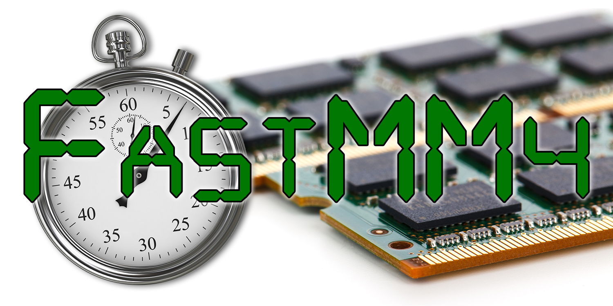

# FastMM4
Fast Memory Manager

## Description:
 A fast replacement memory manager for Embarcadero Delphi applications
 that scales well under multi-threaded usage, is not prone to memory
 fragmentation, and supports shared memory without the use of external .DLL
 files.

## Homepage:
 https://github.com/pleriche/FastMM4

## Advantages:
* Fast
* Low overhead. FastMM is designed for an average of 5% and maximum of 10%
   overhead per block.
* Supports up to 3GB of user mode address space under Windows 32-bit and 4GB
   under Windows 64-bit. Add the "$SetPEFlags $20" option (in curly braces)
   to your .dpr to enable this.
* Highly aligned memory blocks. Can be configured for either 8-byte or 16-byte
   alignment.
* Good scaling under multi-threaded applications
* Intelligent reallocations. Avoids slow memory move operations through
   not performing unneccesary downsizes and by having a minimum percentage
   block size growth factor when an in-place block upsize is not possible.
* Resistant to address space fragmentation
* No external DLL required when sharing memory between the application and
   external libraries (provided both use this memory manager)
* Optionally reports memory leaks on program shutdown. (This check can be set
   to be performed only if Delphi is currently running on the machine, so end
   users won't be bothered by the error message.)
* Supports Delphi 4 (or later), C++ Builder 4 (or later), Kylix 3.

## Usage:
### Delphi:
  Place this unit as the very first unit under the "uses" section in your
  project's .dpr file. When sharing memory between an application and a DLL
  (e.g. when passing a long string or dynamic array to a DLL function), both the
  main application and the DLL must be compiled using this memory manager (with
  the required conditional defines set).
  
  There are some conditional defines
  (inside `FastMM4Options.inc`) that may be used to tweak the memory manager. To 
  enable support for a user mode address space greater than 2GB you will have to
  use the EditBin* tool to set the `LARGE_ADDRESS_AWARE` flag in the EXE header.
  This informs Windows x64 or Windows 32-bit (with the /3GB option set) that the
  application supports an address space larger than 2GB (up to 4GB). In Delphi 6
  and later you can also specify this flag through the compiler directive
  `{$SetPEFlags $20}`
 
 *The EditBin tool ships with the MS Visual C compiler.
### C++ Builder:
  Refer to the instructions inside `FastMM4BCB.cpp`.
