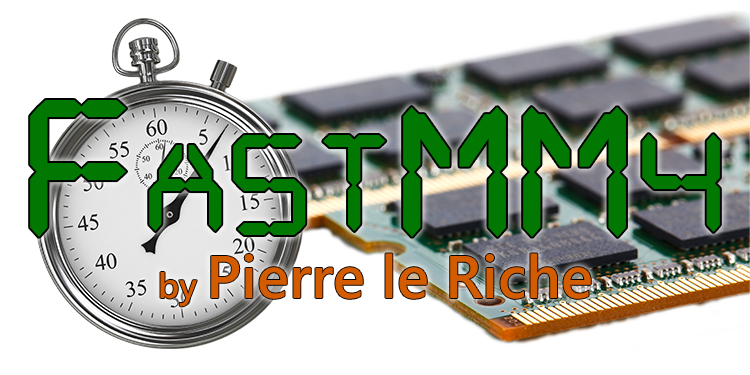
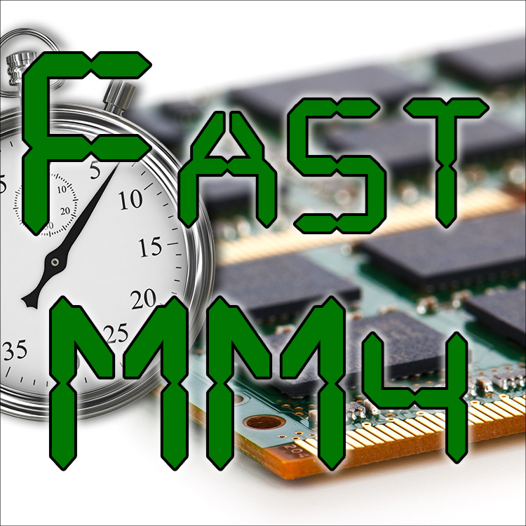
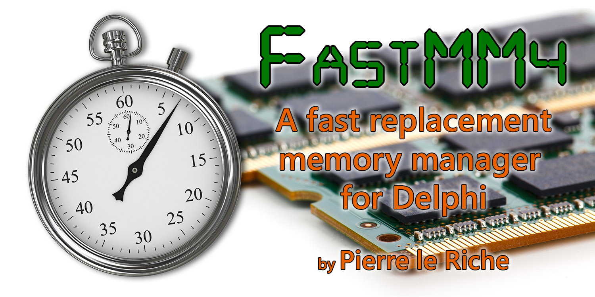
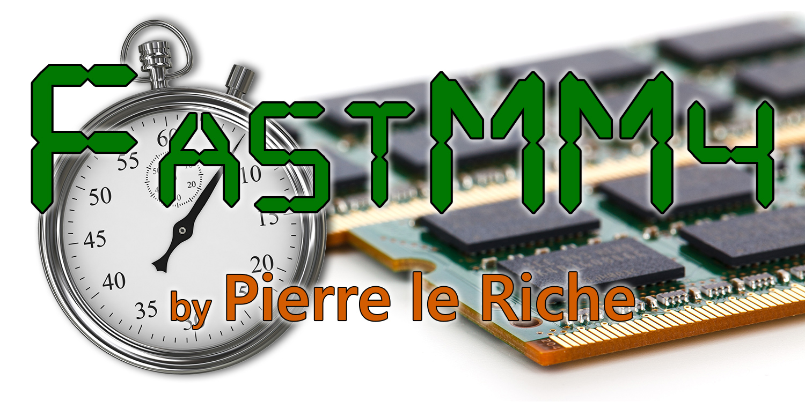

These images were created by Jim McKeeth of Embarcadero Technologies to help recognize Pierre le Riche's FastMM4 project are and licensed under for unlimited use by Pierre le Riche and the FastMM4 project.

[FastMM.png transparent](FastMM.png "FastMM.png transparent")

[FastMM-square-title.jpg square](FastMM-square-title.jpg "FastMM-square-title.jpg square")

[FastMM.jpg with full text](FastMM.jpg "FastMM.jpg with full text")

[FastMM-simple.jpg with simple text](FastMM-simple.jpg "FastMM-simple.jpg with simple text")

[FastMM-Title.jpg with title only](FastMM-Title.jpg "FastMM-Title.jpg with title only")

## Image credits
* Stopwatch by Skeeze https://pixabay.com/photo-2624277/ (CC0)
* Memory from PD Pictures https://pixabay.com/photo-20072/ (CC0)
* Font DigitalDream by Jakob Fischer www.pizzadude.dk - https://www.1001fonts.com/digital-dream-font.html (licensed commercial and personal use)
* Suplemental font Segoe UI https://docs.microsoft.com/en-us/typography/font-list/segoe-ui
